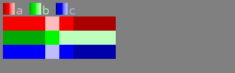
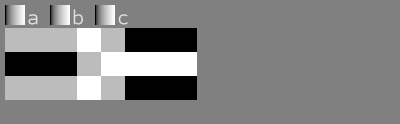

# csvcellplot

Command-line tool to convert CSV files to images where each number in CSV correspond to a rectangle coloured depending on that number.


```
$ printf 'a,b,c\n1,2,3\n1,2,3\n1,2,3\n2,3,4\n1,4,3\n0,4,2\n0,4,2\n0,4,2\n'
a,b,c
1,2,3
1,2,3
1,2,3
2,3,4
1,4,3
0,4,2
0,4,2
0,4,2

$ printf 'a,b,c\n1,2,3\n1,2,3\n1,2,3\n2,3,4\n1,4,3\n0,4,2\n0,4,2\n0,4,2\n' | csvcellplot sample1.png
```



```
$ printf 'a,b,c\n1,2,3\n1,2,3\n1,2,3\n2,3,4\n1,4,3\n0,4,2\n0,4,2\n0,4,2\n' | csvcellplot -g out.png
```



## Features

* Adjustable cell size and colouring
* Overriding colours for specific columns from command line
* Gradiented cells
* Supports moderately large images (e.g. 4000x6000 from 20k data points) - specify small cell size for larger datasets.
* Numbers are automatically converted (interpolated, filtered) for easier visual representation - a middle ground between normalized values and their ranks is used.

## Installation

Download a pre-built executable from [Github releases](https://github.com/vi/csvcellplot/releases) or install from source code with `cargo install --path .`  or `cargo install csvcellplot`.

## CLI options

<details><summary> csvcellplot --help output</summary>

```
Usage: csvcellplot <output_file> [-W <image-width>] [-i <input-csv>] [-w <cell-width>] [-h <cell-height>] [-n] [-H] [--debug-filterted-csv <debug-filterted-csv>] [-c <colour-overrides>] [-S <default-saturation>] [-x <default-min-lightness>] [-X <default-max-lightness>] [-G <default-gradientness>] [-D <default-hue-drift>] [-R <max-cells-in-row>] [-g] [--legend-font <legend-font>] [--legend-font-scale <legend-font-scale>]

read csv data from stdin and write png to file

Positional Arguments:
  output_file       name of output file to write png image to

Options:
  -W, --image-width width of the image to write, default 1920 or automatic if -R
                    is present
  -i, --input-csv   input file to read CSV from, instead of stdin
  -w, --cell-width  width of a cell, in pixels
  -h, --cell-height height of a cell, in pixels
  -n, --no-fiter    do not run data though filter (interpolation), assume they
                    are already from 0 to 1.
  -H, --no-hide     do not hide trivial series
  --debug-filterted-csv
                    output additionla csv with filtered (interpolated) data
  -c, --colour-overrides
                    explicitly specify column colours, like
                    `column1=red,column2=FF00FF` colours may also contain a
                    number of modifier postfix characters: `+`, `-` - shift hue
                    `/` - desaturate. `@` - hue drift `_`,`.` -
                    decrease,increase min lightness `^`, `~` - decrease,
                    increase max lightness `%`, `&` - decrease, increase
                    gradientness
  -S, --default-saturation
                    use this saturation value for colours not specified
                    explicitly. Defaults to 1.0.
  -x, --default-min-lightness
                    defaults to 0.2
  -X, --default-max-lightness
                    defaults to 0.75
  -G, --default-gradientness
                    defaults to 0.0
  -D, --default-hue-drift
                    shift hue toghether with lightness. defaults to 0.0
  -R, --max-cells-in-row
                    maximum number of cell of one data series in a row
  -g, --grayscale   shotrcut for -x 0 -X 1 -S 0
  --legend-font     font file (ttf) to render legend text. Default is embedded
                    font Dharma Type Sometype Mono
  --legend-font-scale
                    font scale to render legend text. Default is 14. Setting it
                    to 0 prevents rendering legend.
  --help            display usage information
```
</details>

## License

Code is licensed with MIT or Apache-2.0. Embedded font file is licensed with IL Open Font License.
